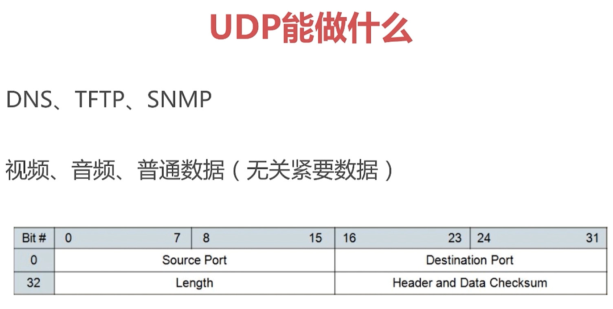
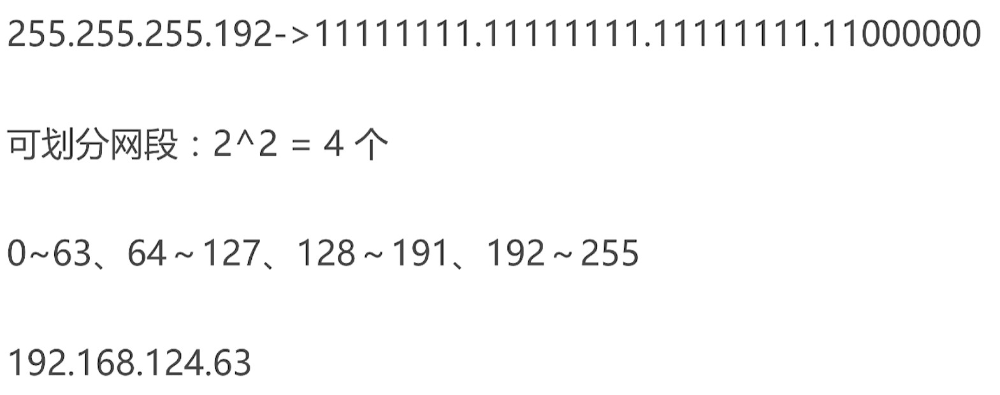
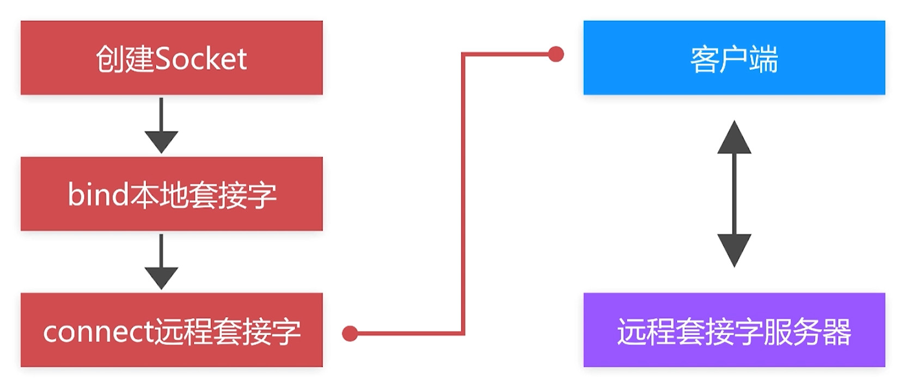
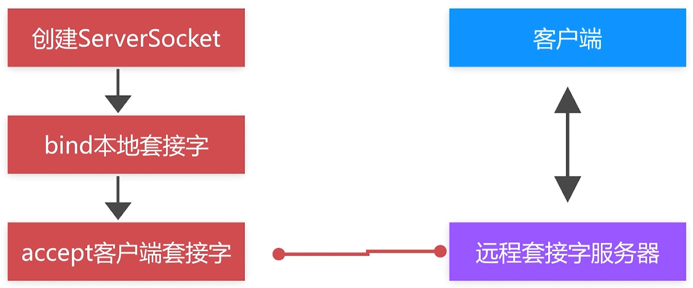
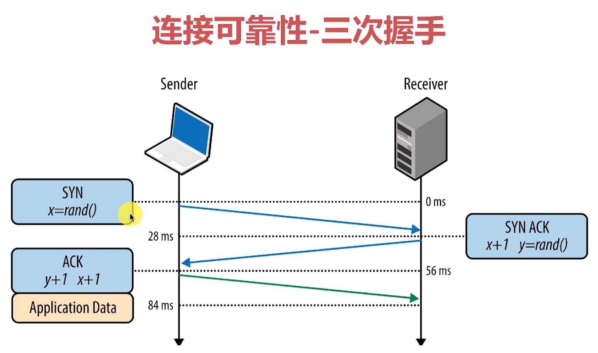
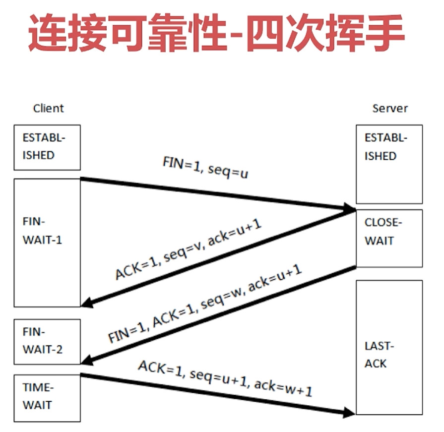
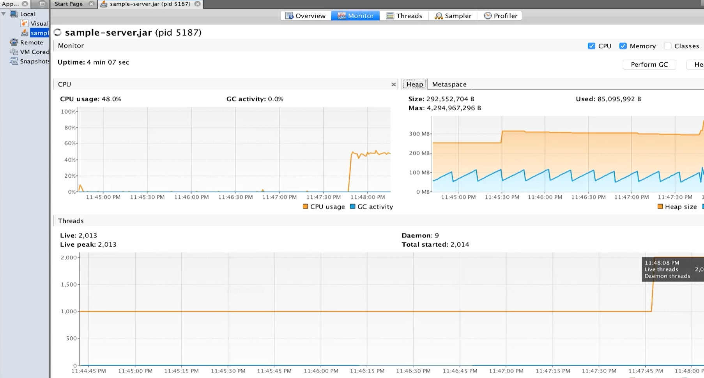
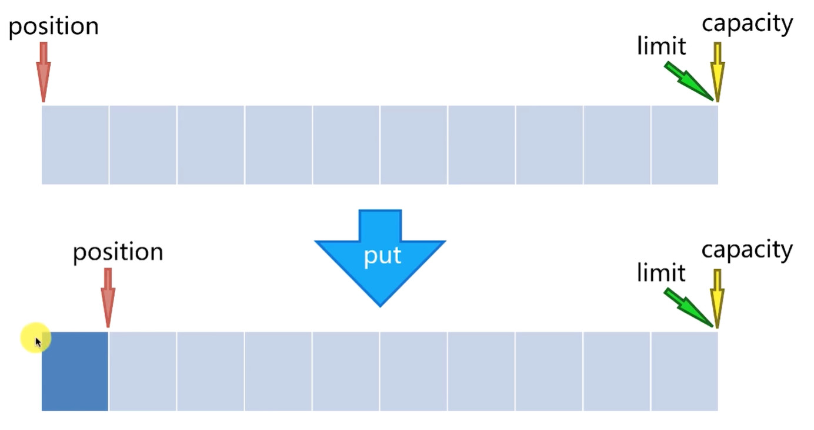
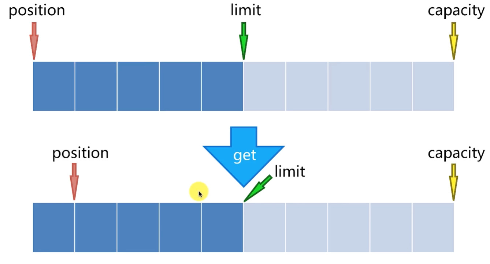
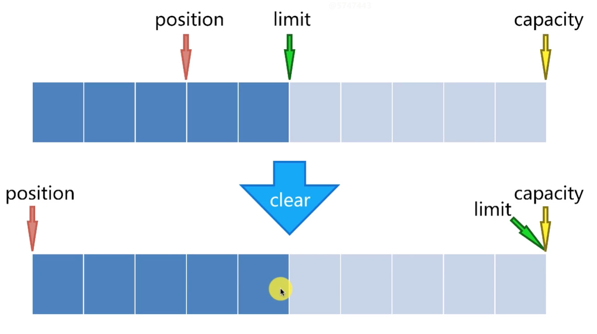

# AndSocketTalk
socket 网络编程

1. **UDP 用户数据报协议**
简单的面向数据报的传输层协议，用户数据协议，非链接协议

* 为什么不可靠
    * 它一旦把应用程序发给网络层的数据发送出去，就不保留数据备份
    * UDP在IP数据报的头部仅仅加入了复用和数据校验（字段）
    * 发送端生产数据，接收端从网络中抓取数据
    * 结构简单、无校验、速度快、容易丢包、可广播




* UDP包最大长度
    * 16位->2字节存储长度信息
    * 2^16-1 = 64K-1 = 65536-1 = 65535
    * 自身协议占用：32+32位=64位=8字节
    * 65535-8 = 65507 byte

* UPP核心api

    * **DatagramSocket** 用于接收与发送UDP的类,负责发送某一个UDP包，或者接收UDP包，UDP没有客户端服务端的说法，既是客户端也是服务端。
        * DatagramSocket()创建简单实例，不指定端口与IP
          DatagramSocket(int port)创建监听固定端口的实例
          DatagramSocket(int port,InetAddress localAddr)创建固定端口指定IP的实例
        * receive(DatagramPacket d):接收
        * send(DatagramPacket d)：发送
        * setSoTimeout(int timeout)：设置超时，毫秒
        * close() 关闭
    * **DatagramPacket**
      用于处理报文，将byte数组、目标地址、目标端口等数据包装成报文或者将报文拆卸成byte数组。是UDP的发送实体，也是接收实体。
      * DatagramPacket(byte[] buf, int offset, int length, InetAddress address, int port)
        前面3个参数指定buf的使用区间
        后面2个参数指定目标机器地址与端口，即要发给谁,如果是接收，那这些参数无效用不到
      
    	>setData(byte[] buf, int offset, int length)
         setData(byte[] buf)
      setLength(int length)
      getData()、 getOffset()、 getLength()
      setAddress(InetAddress iaddr)、 setPort(int iport)
      getAddress()、 getPort()
      setSocketAddress(SocketAddress address)
      getSocketAddress()

1. 单播，广播，多播/组播

    * 广播地址运算
      IP:192.168.124.7
      子网掩码：255.255.255.0
      网络地址(IP和子网掩码进行与或运算得到)：192.168.124.0
      广播地址：192.168.124.255(前3个是网络地址，后一个是255)
      
    * 广播地址运算
      IP:192.168.124.7
      子网掩码：255.255.255.192
      网络地址：192.168.124.0
      广播地址：192.168.124.63
      
      *计算过程：*
      
    
2. **TCP 传输控制协议 面向连接，可靠的，基于字节流的协议，传输层协议**

* TCP 连接机制
  三次握手四次挥手

* TCP能做什么
  * 聊天消息传输、推送
  * 单人语音、视频聊天等
  * 几乎UDP能做的都能做，但需要考虑复杂性、性能问题
  * 限制：无法进行广播，多播等操作

* TCP核心API

  * socket():创建一个Socket
  * bind():绑定一个Socket到一个本地地址和端口上
  * connect()：连接到远程套接字
  * accept()：接受一个新的连接，服务端独有，阻塞并等待客户端套接字
  * write():把数据写入到Socket输出流
  * read():从Socket输入流读取数据

* 使用流程



* 连接的可靠性




* 传输可靠性
    TCP将数据拆分成数据片，然后排序组装，依次发送，一旦某个数据片发送超时或丢失，会重新发送。

######     总结：

######            **UDP可以实现广播发送，也可以搜索，基于报文的传输协议，是不可靠的，更专注于速度；TCP基于链接的协议，是可靠的，更安全，更能保证数据的完整性，UDP能实现的TCP也能实现。**

3. **TCP与UDP的结合**
   
   假设在局域网中，只知道UDP的公共端口，不知道TCP的端口，那这种情况如何实现TCP连接？
   
   > 可以用UDP实现广播搜索，这样客户端收到UDP的一个包的时候，就能拿到端口和ip地址，然后再用TCP进行连接。即：
   >
   > 1. 构建基础口令消息
   >
   > 2. 局域网广播口令消息（指定端口）
   >
   > 3. 接收指定端口回送消息（得到IP、Port）
   >
   >    [代码 /simple_chatroom_07]: https://github.com/Jesen0823/AndSocketTolk/tree/simple_chatroom_07
   
   以上代码案例缺陷：
   
   > 服务器线程数量:
   > 一个客户端：双通->2条线程
   > n个客户端：2n条线程
   > 服务器实际线程数量：2n+,因为有线程监听新客户端到来
   
   经测试，开1000个客户端，线程数会超过2000，内存消耗很大：
   
   
   
   
   
   [性能测试链接 ：simple_chatroom_test_08]: https://github.com/Jesen0823/AndSocketTolk/tree/simple_chatroom_test_08
   
   
   
3. **非阻塞I0**
    NIO全称：Non-blocking l/O
   JDK 1.4引入全新的输入输出标准库NIO，也叫New I/O
   在标准Java代码中提供了高速的、可伸缩性的、面向块的、非阻塞的IO操作。

   * NIO家族
        * Buffer缓冲区：用于数据处理的基础单元，客户端发送与接收数据都需通过Buffer转发进行
        * Channel通道：类似于流；但，不同于IN/OUT Stream；流具有独占性与单向性；通道则偏向于数据的流通多样性
        * Selectors选择器：处理客户端所有事件的分发器

        * **Charset扩展部分**
          Charset字符编码：加密、解密
          原生支持的、数据通道级别的数据处理方式，可以用于数据传输级别的数据加密、解密等操作

        * Buffer包括：
          ByteBuffer, CharBuffer, ShortBuffer, IntBuffer, LongBuffer,
          FloatBuffer, DoubleBuffer
          与传统不同，写数据时先写到Buffer->Channel;读则反之
          为NIO块状操作提供基础，数据都按“块”进行传输
          一个Buffer代表一“块”数据

        * Channel通道

        可从通道中获取数据也可输出数据到通道；按“块”Buffer进行
        可并发可异步读写数据
        读数据时读取到Buffer，写数据则必须通过Buffer写数据。
        包括：FileChannel、SocketChannel、DatagramChannel等。

        * Selector注册事件
          SelectionKey.OP_CONNECT连接就绪
          SelectionKey.OP_ACCEPT接受就绪
          SelectionKey.OP_READ读就绪
          SelectionKey.OP_WRITE 写就绪

        * Selector使用流程
            * open(）开启一个选择器，可以给选择器注册需要关注的事件
            * register()将一个Channel注册到选择器，当选择器触发对应关注事件时回调到Channel中，处理相关数据
            * 阻塞方法select()/selectNow()遍历拿到一个通道Channel,处理一个当前的可用、待处理的通道数据
            * selectedKeys()的到当前就绪的通道
            * wakeUp()唤醒一个处于select状态的选择器
            * close(）关闭一个选择器，注销所有关注的事件

        * 注意事项：
            * 注册到选择器的通道必须为非阻塞状态
            * FileChannel不能用于Selector,因为FileChannel不能切换为非阻塞模式；套接字通道可以

   * **NIO重写服务器**
     
        * 监听客户端到达
        * 接收、回送客户端数据
        * 转发客户端数据到另外一个客户端
       * 多客户端的消息处理
       
        ByteBuffer的补充：
        put()时position会后移一位，假设移动到n位置
        clear()会将position定位到0，limt移动到末尾
        flip()反转，会把position移动到0位置，limt移动到n位置，以便读取操作。
       capacity 容量 alloc的buffer大小
       
       
       
       
   
   ​      
   
   *NIO vs IO
   
      * IO：以流为导向，阻塞IO
   
       读取数据是一条一条串行的工作。
      * NIO：以缓冲区为导向，非阻塞IO，Selector选择器会将SocketChannel注册到select
          SocketChannel里面将会存在一份SocketKey, 是注册channel的一个变量，代表了当前的注册状态。
   
        Channel注册到select中，通过Selector.select()得到
        SelectorKey的一个集合，在该集合中就可以知道是哪一个channel读取了数据，然后开始读取数据
         channel会读数据到一个buffer中，然后接着处理下一个数据；虽然也是串行的，但是处理数据是channel有数据才会处理，不是阻塞的。
   
           * [**BIO NIO AIO的介绍与区别**](https://blog.csdn.net/ty497122758/article/details/78979302)
   
   * 消息粘包
     “粘包”是数据处理的逻辑层面上发生的粘包
     这里所说的“粘包”：包含TCP、UDP甚至其他任意的数据流交互方案，比如依次发送数据包M1,M2,M3,，可能的情况是M1和M2同时到达同时被接收，这就发生了消息粘包。
      Mina、Netty等框架从根本来说也是为了解决粘包而设计的高并发库。
   
   * 消息不完整
      从数据的传输层面来讲TCP也不会发生数据丢失不全等情况
      一旦出现一定是TCP停止运行终止之时
       “数据不完整”依然针对的是数据的逻辑接收层面
   
      在物理传输层面来讲数据一定是能安全的完整的送达另一端
      但另一端可能缓冲区不够或者数据处理上不够完整导致数据只能读取一部分数据
       这种情况称为“数据不完整”“数据丢包”
   
   * 如何有序的混传数据
     数据传输加上开始结束标记
     数据传输使用固定头部的方案
      混合方案：固定头部、数据加密、数据描述
   
   * Http1.0每次请求都会建立一个socket链接，请求完会断开
      Http2.0 可以请求复用，建立一个链接可以发起多次请求keep-alive
   
3. 项目框架图


4. 局域网文件快传

  * **文件传输与普通传输区别**
    最大的差别：文件数据bytes远远大于普通数据bytes
    文件传输需分片，组装分片
    文件传输如何中途取消而不影响后续的Packet发送
    文件传输校验，保证数据准确性

    
    相比普通数据传输，文件传输用byte[]是不合适的，需要用到流 inputstream

  * 将基于Packet的传输改为ByteArrayStream的流传输，packet一般用于String传输

  * 文件分片的原因
    发送中无法取消文件发送
    大文件传输容错率较低
    同一链接无法实现文件、普通消息优先级
    

      *  分片逻辑实现
         根据文件大小计算分片、并读取数据到分片
         分片数据固定格式打包发送
         分片数据解析与分片组装
         Dispatcher调度逻辑调整

      
      
      

  * 分片发送真实的接收顺序可能是这样的：
    

   于是需要封装packet,保存Packet、通道、未接收数据长度信息存储：
   ```java
     static class PacketModel {
             final ReceivePacket packet;
             final WritableByteChannel channel;
             volatile long unreceivedLength;

             PacketModel(ReceivePacket<?, ?> packet) {
                 this.packet = packet;
                 this.channel = Channels.newChannel(packet.open());
                 this.unreceivedLength = packet.length();
             }
         }
   ```


5. 心跳包

* 心跳包的作用
  客户端与服务器之间相互告知状态
  通过定时发送信息，让中间运营商的NAT路由表得以维持；避免路由表过期带来的异常中断
  由于其约定性、定时性所以称为心跳包

* 心跳策略选择
  TCP : KeepAlive 7200 2H ACK
  TCP：KeepAlive仅代表连接保持，而不代表对方业务层是否可消费数据
  HTTP：Keep-Alive意图在于连接复用，同一个连接上串行方式传递请求-响应数据


* 心跳包发送与消费
  客户端发送心跳数据，服务器接收数据，但并不回送业务数据包；
  此时客户端依然会收到数据确认包（ACK）
  服务器使用10倍长时扫描客户端方案进行客户端活跃性扫描，超出时间未活跃则自动关闭链接
  服务端和客户端用定时器定时发送心跳维持链接的确定，一般是服务端定时向所有客户端定时发送心跳扫描。

5. 语音即时通信

转发：数据到达服务器，然后消费并转发给特定客户端
桥接：客户端与客户端通过服务器建立私有管道
简单来说：数据在管道消费传输，不上升到业务层
服务器：起到代理桥接的作用

* 普通数据传输过程
   

   
   

* 桥接模式
 

     * 服务器桥接改造难点
        * 如何识别桥接命令
        * 如何建立“管道”->ROOM房间
        * 房间建立、房间销毁、连接复用
        * loArgs固定长度读取、写入问题

* 语音通信
  

* 语音采集编码技术
  Gxx时代：G711,G722,G723.1,G729ab等等
  AMRNB/WB,Speex,ILBC/ISAC,SILK时代
  Opus/EVS时代-跨度大、还原度高、自动学习
  Oboe/Google高性能的音频-自动延迟调整

  * Opus优势
    采样率从8至48 kHz、比特率从6kb/s到510kb/s
    对固定码率（CBR）和可变码率（VBR）都能支持、窄带到宽带的音频带宽
    支持语音和音乐、支持单声道和立体声
    支持多通道（最多255通道）、帧规格从2.5毫秒到60毫秒
    对人声和音乐的还原度高

  * 语音通信过程
  

